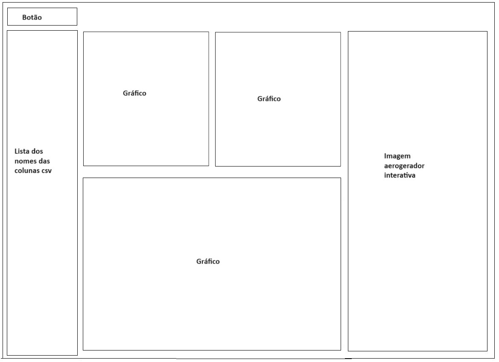
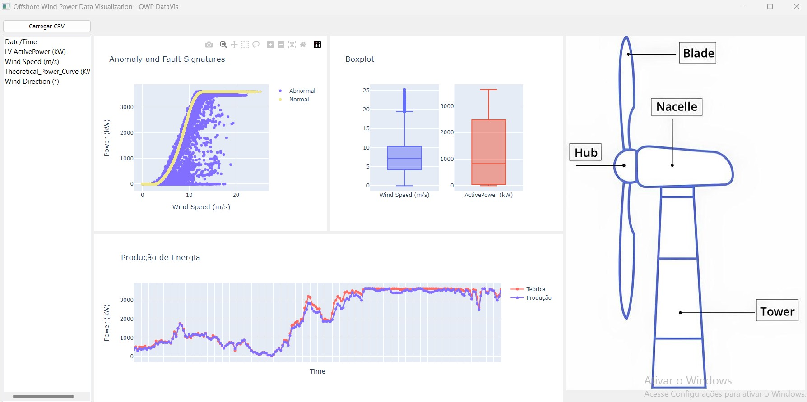

<h1>INF723-Visualizacao-de-Dados</h1>

<h2>Sumário</h2>
<ol>
    <li>Descrição</li>
    <li>Estrutura de Diretórios</li>
    <li>Instalação</li>
    <li>Layout</li>
    <li>Tipos de commits</li>
</ol>

<h2>Descrição</h2>

<h2>Estrutura de Diretórios</h2>
<pre>
├── INF723-Visualizacao-de-Dados
  |  ├── dataset-example
  |  │   ├── wind-data.csv
  |  ├── documentation
  |  │   ├── _topo.scss
  |  │   ├── _menu.scss
  |  │   ├── _sidebar.scss
  |  │   └── _footer.scss
  |  ├── notebook
  |  │   ├── _topo.scss
  |  │   ├── _menu.scss
  |  │   ├── _sidebar.scss
  |  │   └── _footer.scss
  |  ├── presentation
  |  │   ├── _topo.scss
  |  │   ├── _menu.scss
  |  │   ├── _sidebar.scss
  |  │   └── _footer.scss
  |  ├── system
  |  │   ├── _topo.scss
  |  │   ├── _menu.scss
  |  │   ├── _sidebar.scss
  |  │   └── _footer.scs
  |  │   └── _footer.scs
  |  │   └── _footer.scs
  |  │   └── _footer.scs
  |  ├──README.md
  |  ├──task-description.pdf
</pre>

<h2>Instalação</h2>

<h2>Layout</h2>

<h2>Tipos de commits:</h2>
<ul>
    <li><strong>feat:</strong> Uma nova feature (recurso) que você está adicionando a uma aplicação específica.</li>
    <li><strong>fix:</strong> A resolução de um bug.</li>
    <li><strong>style:</strong> Recurso e atualizações relacionadas à estilização.</li>
    <li><strong>refactor:</strong> Refatoração de uma seção específica da base de código.</li>
    <li><strong>test:</strong> Tudo o que for relacionado a testes.</li>
    <li><strong>docs:</strong> Tudo o que for relacionado à documentação.</li>
    <li><strong>chore:</strong> Manutenção regular do código.</li>
</ul>

